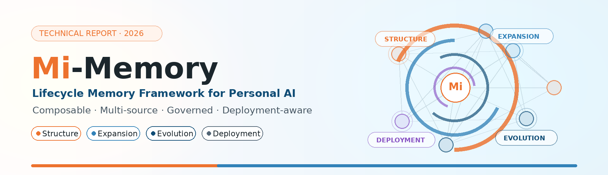
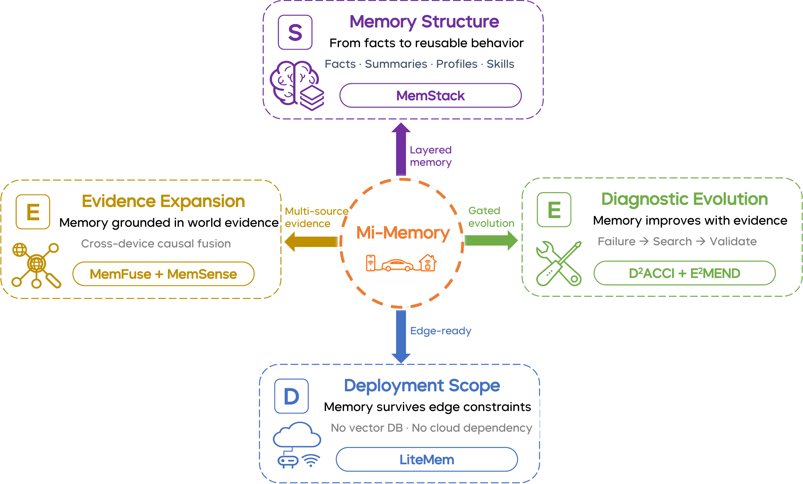

<p align="center">
  
</p>

<h1 align="center">Mi-Memory</h1>

<p align="center">
  <strong>A Lifecycle Memory Framework for Personal AI</strong>
</p>

<p align="center">
  <a href="https://darwin-agent.github.io/Mi-Memory/"></a>
  <a href="https://arxiv.org/abs/2607.18975"></a>
  
  <a href="LICENSE"></a>
  
</p>

<p align="center">
  <a href="https://darwin-agent.github.io/Mi-Memory/">Homepage</a> •
  <a href="#-overview">Overview</a> •
  <a href="#-architecture">Architecture</a> •
  <a href="#-highlights">Highlights</a> •
  <a href="#-results">Results</a> •
  <a href="#-citation">Citation</a>
</p>

---

## 📢 News

- **2026-07** — Technical report released on arXiv: [**Mi-Memory: A Lifecycle Memory Framework for Personal AI**](https://arxiv.org/abs/2607.18975).
- **2026-07** — Repository is live as a project introduction page with the report PDF and overview figures.

## 🧭 Overview

Project homepage: **https://darwin-agent.github.io/Mi-Memory/**

This repository currently hosts the Mi-Memory technical report, project homepage, and visual assets.

Personal AI is moving beyond chat-only interaction toward continuous services across phones, cars, homes, wearables, cameras, and tools. In this setting, memory cannot remain a cache of prior conversations: it must preserve durable user state, connect answers to multimodal and device evidence, support correction and forgetting, bound policy evolution, and remain deployable across edge/cloud constraints.

**Mi-Memory** is a lifecycle memory framework organized around four roles:

- **Structure** — memory runtime, storage hierarchy, retrieval, filtering, and context assembly.
- **Expansion** — multimodal and cross-device evidence acquisition.
- **Evolution** — diagnostic iteration, governed strategy updates, and rollback.
- **Deployment** — substrate-independent memory variants for constrained environments.

## 📐 Architecture

<p align="center">
  
</p>

Mi-Memory links the lifecycle through a shared audit contract: typed evidence payloads preserve source identity and provenance, diagnostic traces localize evidence loss, strategy artifacts make memory-policy changes explicit, and gate/rollback records bound accepted evolution.

## ✨ Highlights

| | |
|---|---|
| 🧱 **Composable memory structure** | Multi-granularity storage with stage-level diagnostic traces. |
| 🌐 **Multi-source evidence** | Dialogue, multimodal perception, cross-device events, and causal fusion. |
| 🔄 **Governed evolution** | D²ACCI and E²MEND governed strategy evolution. |
| 📦 **Deployment flexibility** | Full-stack cloud reference and repository-native lightweight memory variant. |
| 📊 **Comprehensive evaluation** | Structure benchmarks plus module-level, transfer-feasibility, and design-level evidence. |

## 📊 Results

The results below summarize evidence anchors from the technical report. They are reported role by role rather than as a single leaderboard, and evidence maturity differs across tracks. See the [arXiv report](https://arxiv.org/abs/2607.18975) for the authoritative numbers, protocols, evidence boundaries, and detailed analysis.

| Benchmark | Track | Metric | Score |
|:----------|:------|:-------|------:|
| **LoCoMo** | Structure | Judge Accuracy | **93.59%** |
| **PersonaMem-V2** | Structure | Preference Accuracy | **57.24%** |
| **LongMemEval** | Structure | Judge Accuracy | **87.47%** |
| **Mem-Gallery** | Expansion | Judge Accuracy (3-vote) | **89.15%** |
| **MemFuseBench** | Expansion | Internal Fusion Score | **35.2%** |
| **D²ACCI / E²MEND LoCoMo** | Evolution | Offline Run Accuracy | **94.74%** |
| **LiteMem / LoCoMo-aligned** | Deployment | Transfer Score / Retention | **90.81% / 90.0%** |

## 🔭 Outlook

Mi-Memory is an initial step toward auditable personal-AI memory infrastructure. Future work will focus on stronger causal attribution, propagation-complete forgetting, federated cross-device memory, scalable diagnostic evolution, and standardized memory contracts.

## 📁 Repository Contents

```text
.
├── index.html             # GitHub Pages project homepage
├── paper.pdf              # Released technical report
├── figure/                # README-facing visual assets
├── LICENSE
└── README.md
```

> This repository is an introduction page for the Mi-Memory technical report.

## 📖 Citation

If you find this work useful, please cite:

```bibtex
@techreport{mimemory2026,
  title       = {Mi-Memory: A Lifecycle Memory Framework for Personal AI},
  author      = {Darwin Agent Team},
  institution = {Xiaomi},
  year        = {2026},
  url         = {https://arxiv.org/abs/2607.18975}
}
```

## License

This project is licensed under the [MIT License](LICENSE).
